<picture>
  <source media="(prefers-color-scheme: dark)" srcset="https://readme-typing-svg.demolab.com?font=Fira+Code&weight=600&size=24&duration=2800&pause=900&color=C4B5FD&center=true&vCenter=true&width=620&height=50&lines=no+cap%2C+just+code+%F0%9F%A7%A2;debugging+is+my+cardio+%F0%9F%8F%83;it%27s+giving...+Python+%F0%9F%90%8D;locked+in.+no+distractions+%F0%9F%94%92;68+down%2C+32+to+go+%F0%9F%9A%80">
  
</picture>

  
  
  
  

<table>
  <tr>
    <td align="center">
       
      <b>me, speedrunning problem #69 at 3 am</b>
    </td>
    <td align="center">
       
      <b>#69? that's what she said.</b>
    </td>
  </tr>
</table>

## 📈 the grind, quantified

## 🎭 the grind, visualized

<table>
  <tr>
    <td align="center">
       
      <b>code runs first try</b>
    </td>
    <td align="center">
       
      <b>code does not run</b>
    </td>
    <td align="center">
       
      <b>reading my own code from last week</b>
    </td>
  </tr>
  <tr>
    <td align="center">
       
      <b>me, to the bug, at 3 am</b>
    </td>
    <td align="center">
       
      <b>47 tabs closed. it was indentation.</b>
    </td>
    <td align="center">
       
      <b>walking out after a hard one</b>
    </td>
  </tr>
</table>

## 🍳 what's cooking

**[📓 the notebook](python_interview_par.ipynb)** · 68 problems. every single one solved, explained and runnable. patterns, sorting, OOP, decorators, trees. the whole menu.

**[📝 the theory sheet](python_interview_questions.md)** · 30 questions that Google, Microsoft and Infosys interviewers actually ask, answered like a human and not a textbook.

> yes, there is a section on dunder methods. Dunder Mifflin methods. sorry.

no setup. no `requirements.txt`. just Python and vibes.

 ← one click. runs in your browser. your laptop can keep napping.

## ⭐ rate the vibe

if this repo made you smile, drop a star. it's free, and it makes the cat happy.

**you starred? finger guns.**

 

built with 🐍, ☕ and the confidence of a regional manager.

